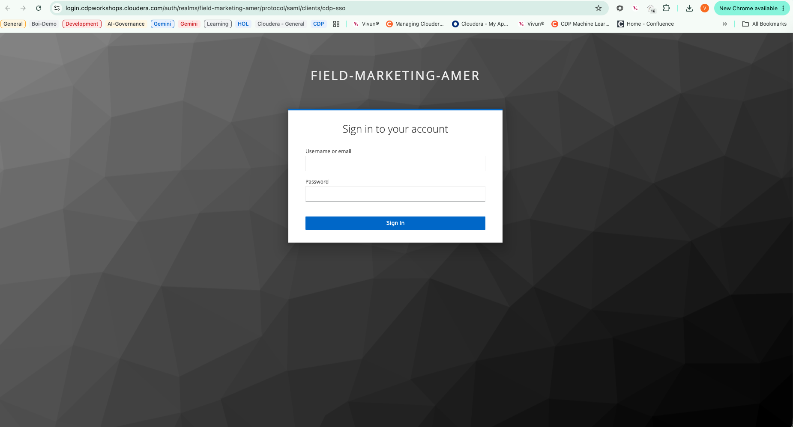
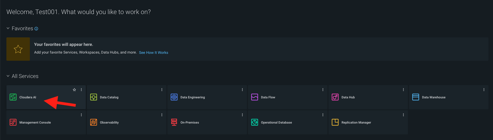
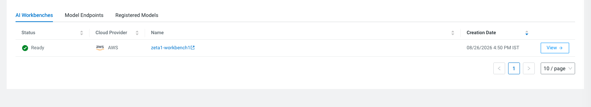

# Login and Workbench Setup

This section covers how to log into the Cloudera Data Platform (CDP) workshop environment and navigate to the shared AI workbench for the Zeta Global hackathon.

## Step 1: Log In to Cloudera

Open the workshop login URL in your browser:

**[https://login.cdpworkshops.cloudera.com/auth/realms/field-marketing-amer/protocol/saml/clients/cdp-sso](https://login.cdpworkshops.cloudera.com/auth/realms/field-marketing-amer/protocol/saml/clients/cdp-sso)**

Enter the credentials provided by your instructor:

| Field | Value |
|-------|-------|
| **Username or email** | `<provided by your instructor>` |
| **Password** | `<provided by your instructor>` |

Click **Sign In** to authenticate.

*Figure 1: Sign in to your account on the FIELD-MARKETING-AMER realm.*

!!! note "Credentials"
    Your instructor will distribute workshop credentials before the session begins. Do not share credentials outside your team.

---

## Step 2: Select Cloudera AI

After logging in, you will land on the CDP home dashboard. Under **All Services**, locate and click **Cloudera AI**.

*Figure 2: Click the Cloudera AI tile (indicated by the arrow) from the All Services grid.*

---

## Step 3: Select the Zeta Workbench

On the **AI Workbenches** tab, find the workbench named **`zeta1-workbench1`**. It should show a **Ready** status with AWS as the cloud provider.

Click the workbench name or the **View →** button to open it.

*Figure 3: Open the zeta1-workbench1 workbench — status should be Ready.*

!!! success "You're In!"
    Once the workbench opens, you are inside the Cloudera AI environment where all hackathon work takes place. Continue to [Project Creation & Runtimes](../setup/project-and-runtimes.md) to set up your team project.

## Troubleshooting

| Issue | Solution |
|-------|----------|
| Login page does not load | Verify the URL and check your network/VPN settings |
| Invalid credentials | Confirm username/password with your instructor |
| Workbench not visible | Refresh the page; contact your instructor if `zeta1-workbench1` is missing |
| Workbench status not Ready | Wait a few minutes and refresh; contact support if it persists |
