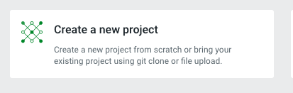
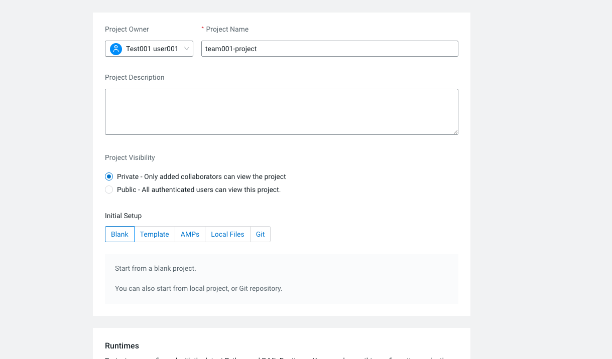

# Project Creation and Runtimes

All hackathon work happens inside a **Cloudera AI Project**. Each team creates one project using the naming convention below and configures the appropriate Python runtime.

## Step 1: Create a New Project

From the workbench home page, click **Create a new project**.

*Figure 1: Click "Create a new project" to begin.*

### Project Configuration

Fill in the project form as follows:

| Field | Value |
|-------|-------|
| **Project Owner** | Your assigned user (e.g., `Test001 user001`) |
| **Project Name** | `TeamName-ProjectName` (e.g., `Team001-documentanalysis`) |
| **Project Description** | Brief description of your hackathon project |
| **Project Visibility** | **Private** (recommended) |
| **Initial Setup** | **Blank** |

*Figure 2: Example project name — `team001-project` (use your team name + project name).*

!!! tip "Naming Convention"
    Use the format **`TeamXXX-<descriptive-name>`** so instructors can easily identify your team's work. Examples:

    - `Team001-documentanalysis`
    - `Team002-customer-segmentation`
    - `Team003-recommendation-engine`

Click **Create** to provision your project.

---

## Step 2: Configure Runtimes

After project creation, configure your session runtime:

| Setting | Recommended Value |
|---------|-------------------|
| **Editor** | JupyterLab |
| **Kernel** | **Python 3.12** or higher |
| **Edition** | Standard Python runtime (or Claude Code with CAI Inference for AI-assisted coding — see [Claude Private Model](../vibe-coding/claude-private-model.md)) |
| **Version** | Latest available |

!!! info "Python Version"
    Select **Python 3.12 or higher** for all notebook and script work. This ensures compatibility with the sample data loading notebook and modern Python libraries.

### Enabling Additional Runtimes

If you need the **Claude Code with CAI Inference** runtime:

1. Open **Project Settings**
2. Navigate to **Runtimes**
3. Enable **Claude Code with CAI Inference**
4. Save settings

You can then select this runtime when starting a new session.

---

## What's Next?

Your project is the workspace for all hackathon deliverables. From here:

- **[Vibe Coding with Cloudera AI](../vibe-coding/cursor-remote-ssh.md)** — Set up Cursor or Claude CLI for AI-assisted development
- **[Sample Code: Data Upload](../sample-code/data-upload.md)** — Load sample metric data into your project

## Troubleshooting

| Issue | Solution |
|-------|----------|
| Project name already taken | Add a suffix or use a more specific project name |
| Runtime not available | Enable it in **Project Settings → Runtimes** |
| Project creation fails | Check resource quotas with your instructor |
