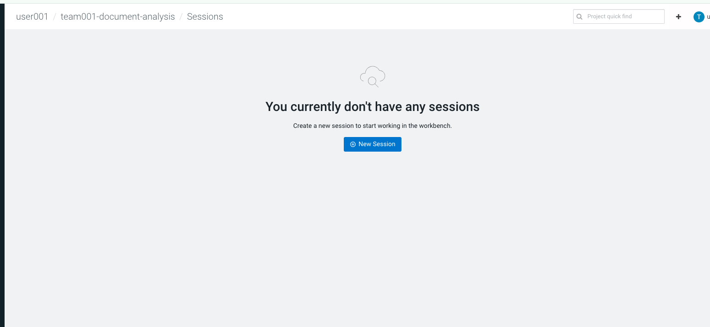
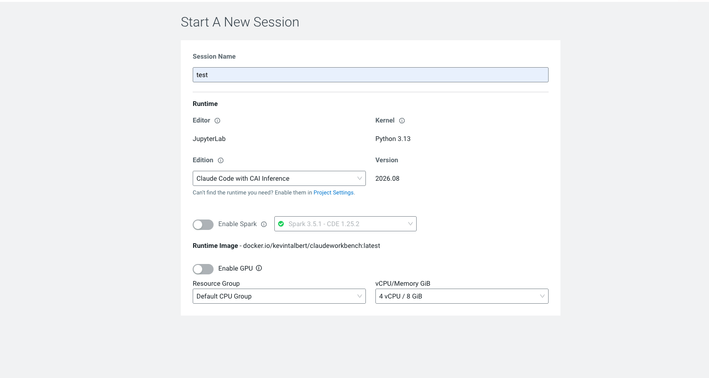
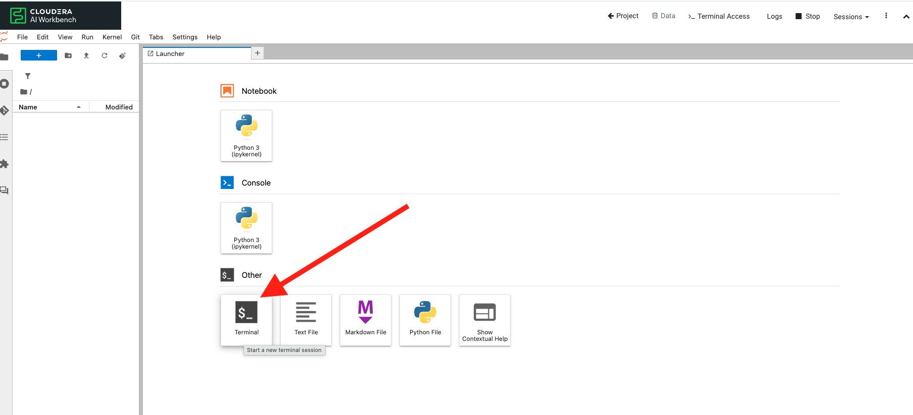
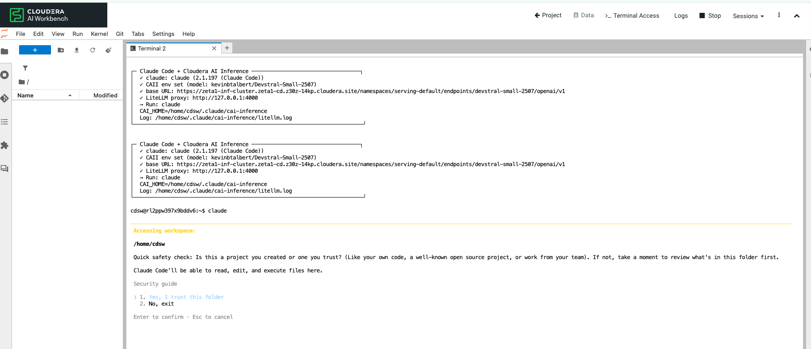

# Using Claude with a Private Model

Cloudera AI provides a pre-configured **Claude Code with CAI Inference** runtime for the hackathon. This lets you use the **Claude CLI** directly in your workbench terminal with a private model endpoint — no external API keys required.

## Overview

The Claude runtime includes:

- **Claude Code CLI** — Interactive AI coding assistant in the terminal
- **Cloudera AI Inference** — Private model endpoint (LiteLLM proxy)
- **Pre-configured environment** — Ready to use out of the box

## Step 1: Open Your Project

Navigate to the project you created in [Project Creation & Runtimes](../setup/project-and-runtimes.md).

## Step 2: Start a New Session

1. Go to the **Sessions** tab in your project
2. Click **+ New Session**



*Figure 1: Click "+ New Session" to start a new workbench session.*

### Session Configuration

Configure your session with these settings:

| Setting | Value |
|---------|-------|
| **Session Name** | A descriptive name (e.g., `claude-dev`, `team001-session`) |
| **Editor** | JupyterLab |
| **Kernel** | Python 3.13 |
| **Edition** | **Claude Code with CAI Inference** |
| **Version** | Latest (e.g., `2026.08`) |
| **Enable Spark** | Off (unless your project requires Spark) |
| **Enable GPU** | Off (unless needed) |
| **Resource Group** | Default CPU Group |
| **vCPU / Memory** | **Minimum 2 vCPU / 4 GiB** (4 vCPU / 8 GiB recommended) |



*Figure 2: Select "Claude Code with CAI Inference" edition and appropriate compute profile.*

!!! warning "Minimum Resources"
    Select at least **2 vCPU and 4 GiB memory**. The example above uses 4 vCPU / 8 GiB for better performance.

Click **Start Session** and wait for the session to become ready.

## Step 3: Open the Terminal

Once your session is running:

1. In the JupyterLab **Launcher**, scroll to the **Other** section
2. Click **Terminal**



*Figure 3: Click the Terminal icon under "Other" in the Launcher.*

## Step 4: Launch Claude CLI

In the terminal, run:

```bash
claude
```

You will see the Claude Code environment information:

```
Claude Code + Cloudera AI Inference
Claude Version: claude (2.1.x (Claude Code))
Model: kevinbtalbert/Devstral-Small-2507
Base URL: https://.../openai/v1
Proxy: LiteLLM proxy: http://127.0.0.1:4000
```



*Figure 4: Run `claude` in the terminal to start the interactive AI assistant.*

## Step 5: Complete the Security Guide

On first launch, Claude presents a security guide. Select these defaults:

| Prompt | Select |
|--------|--------|
| **Do you trust this folder?** | **1. Yes, I trust this folder** |
| **Do you want to use this API Key?** | **No** |

Press **Enter** to confirm each selection.

!!! info "Why These Defaults?"
    - **Trust folder**: Allows Claude to read and modify files in your project directory
    - **No API Key**: The session uses the pre-configured Cloudera AI Inference proxy — no external key needed

## Step 6: Start Vibe Coding

You're ready to use Claude for AI-assisted development. Example prompts:

```text
Create a Python script that loads sample_metric_data.json and prints summary statistics
```

```text
Help me build a data pipeline that reads from the artifacts folder and writes to a DataFrame
```

```text
Explain the dataload_notebook.ipynb and suggest improvements
```

### Useful Claude CLI Commands

| Command | Description |
|---------|-------------|
| `claude` | Start interactive session |
| `/help` | Show available commands |
| `/clear` | Clear conversation history |
| `Ctrl+C` | Exit Claude CLI |

## Environment Details

Your session automatically configures:

| Variable | Purpose |
|----------|---------|
| `CAI_HOME` | Cloudera AI Inference configuration directory |
| LiteLLM Proxy | Local proxy at `http://127.0.0.1:4000` routing to private model |
| Model | Pre-selected private model for the workshop |

Verify your environment:

```bash
echo $CAI_HOME
claude --version
```

## Troubleshooting

| Issue | Solution |
|-------|----------|
| `claude` command not found | Ensure you selected **Claude Code with CAI Inference** runtime |
| Session fails to start | Increase compute profile to 4 vCPU / 8 GiB |
| Model connection error | Restart the session; check LiteLLM proxy is running |
| Security prompt loops | Select option 1 (Yes) for folder trust, then No for API key |
| Slow responses | Upgrade compute profile or simplify prompts |

## Next Steps

- Load sample data using the [Data Upload notebook](../sample-code/data-upload.md)
- Connect Cursor via [Remote SSH](cursor-remote-ssh.md) for IDE-based development
