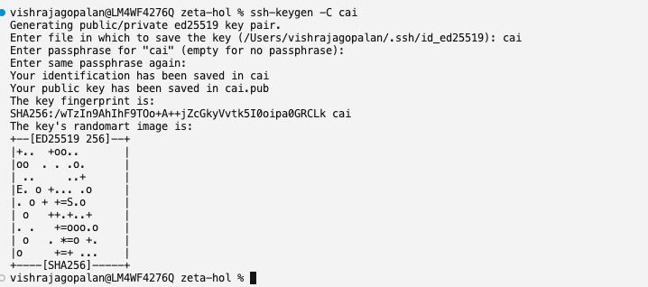
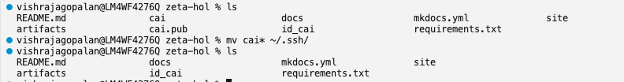
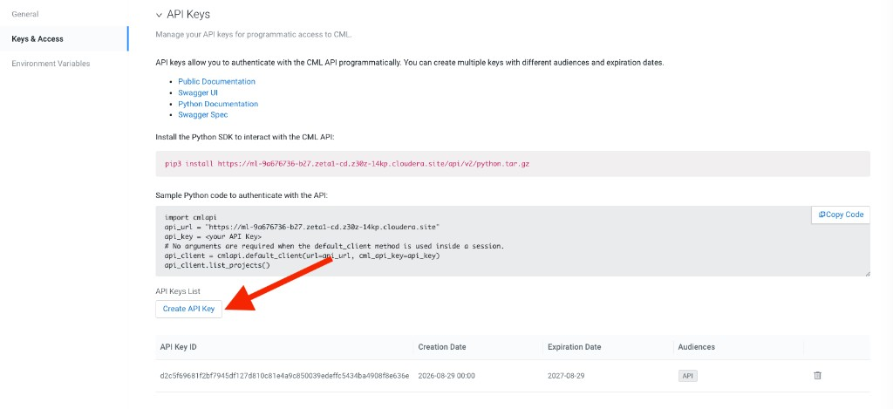
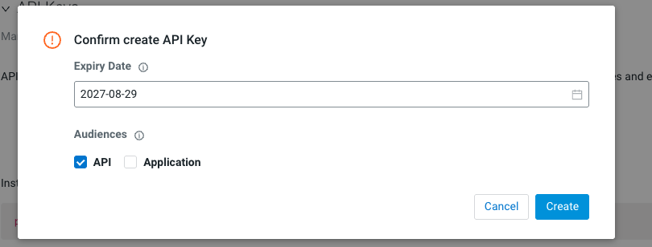
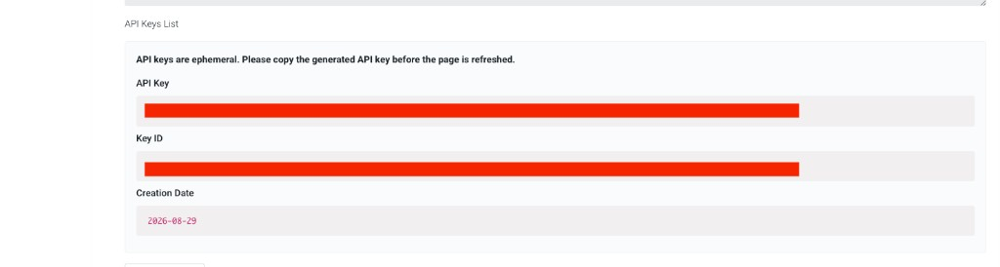

# Using Cursor with Cloudera AI (Remote SSH)

This guide explains how to connect **Cursor IDE** to your Cloudera AI workbench session using **Remote SSH** and the **cdswctl** CLI, enabling AI-assisted coding directly against your project environment.

## Prerequisites

Before connecting, ensure you have:

- [x] Completed [Login & Workbench Setup](../setup/login-and-project.md)
- [x] Created your team [project](../setup/project-and-runtimes.md)
- [x] **Cursor IDE** installed on your local machine ([cursor.com](https://cursor.com))

---

## One-time Setup

### 1. Generate an SSH Key

Run the following command to generate a new SSH key pair:

```bash
ssh-keygen -C cai
```

When prompted **"Enter file in which to save the key"**, type `cai` (this creates the key in your current directory rather than the default location).

Press **Enter** to skip the passphrase prompts (leave both empty).



### 2. Move the Keys to `~/.ssh/`

Move the generated private and public key files into your SSH directory:

```bash
mv cai* ~/.ssh/
```

Verify the keys are no longer in your current directory:

```bash
ls ~/.ssh/cai*
```

You should see `~/.ssh/cai` (private key) and `~/.ssh/cai.pub` (public key).



### 3. Copy the Public Key

```bash
cat ~/.ssh/cai.pub
```

Copy the entire output line.

### 4. Add the Key to the Workbench

In the Cloudera AI Workbench, go to **User Settings → Keys & Access → Remote Editing**, paste your public key into **SSH Public Key**, and click **Add**.


### 5. Download the CML CLI Client

On the same **Remote Editing** page, download the **CML CLI client** (`cdswctl`) for your operating system.


On Mac, if the download is blocked: **Finder → Control-click → Open**.


### 6. Add cdswctl to Your PATH

After downloading, unpack the archive and optionally add `cdswctl` to your system `PATH` environment variable.

### 7. Create an API Key

In the Cloudera AI Workbench, go to **User Settings → Keys & Access → API Keys** and click **Create API Key**.



In the confirmation dialog, accept the default expiry settings (ensure **API** is checked under Audiences) and click **Create**.



!!! warning "Save Your API Key Immediately"
    API keys are **ephemeral** — they are shown only once. Copy the generated API key and save it in a notepad or password manager. You will need this key every time you log in with `cdswctl`.



### 8. Create the SSH Config Entry

Add the following entry to `~/.ssh/config`:

```ssh-config
Host cai-workbench
    HostName localhost
    Port 3735
    User cdsw
    IdentityFile ~/.ssh/cai
    StrictHostKeyChecking no
    ServerAliveInterval 60
    ServerAliveCountMax 10
```

!!! note "Port Changes Each Session"
    The `Port` value will need updating each session — see step 4 under [Every-session Steps](#every-session-steps) below.

---

## Every-session Steps

### 1. Log In to CAI Workbench Remotely

Use the **API key** you saved in your notepad during one-time setup:

```bash
cdswctl login -u https://ml-9a676736-b27.zeta1-cd.z30z-14kp.cloudera.site -n <username> -y <api key you copied in notepad>
```

Replace `<username>` with your Cloudera AI username and paste the API key you saved earlier.

If Mac prevents you from running the `cdswctl` command, remove the quarantine attribute:

```bash
xattr -d com.apple.quarantine /<PATH>/cdswctl
```

Wait for **"Login succeeded."**

### 2. Start the Endpoint

Spin up a session with the following command:

```bash
cdswctl ssh-endpoint -p <your-user-name/your-project-name> -r 127 -c 4 -m 8
```

Replace `<your-user-name/your-project-name>` with your actual username and project name (e.g., `vishrajagopalan/test`). It takes a minute or two for the session to start.

You can verify from the CAI Workbench **Project → Sessions** tab that the new session has been created.


### 3. Read the Port

The command prints connection details:

```text
You can SSH to the session using
    ssh -p <PORT> cdsw@localhost
```

Leave this terminal open — this process is the tunnel.


### 4. Update the Port in SSH Config

If `<PORT>` differs from what is saved in `~/.ssh/config` (it changes every session), edit the `Port` line under `cai-workbench` to match.

### 5. Sanity Check (Optional)

In a second terminal:

```bash
ssh -p <PORT> cdsw@localhost
```

Run `whoami` — it should return `<username>`. Type `exit` to leave.

### 6. Connect in Cursor

1. Press **Cmd+Shift+P** (Mac) or **Ctrl+Shift+P** (Windows/Linux)
2. Select **Connect via SSH: Connect to Host**
3. Choose **`cai-workbench`**
4. Enter your key passphrase if prompted
5. **File → Open Folder → `/home/cdsw`**


Your SSH connection to the CAI session is ready for use in Cursor.

### 7. Shut Down When Done

Press **Ctrl+C** in the `cdswctl` terminal to shut down the session and stop consuming workbench resources.


---

## Testing Cursor

Once connected to your Cloudera AI project via Remote SSH, you can verify that Cursor works end-to-end by asking the AI Agent to build a sample machine learning pipeline that reads from and writes to the DataLake.

### 1. Open the Agent Window

In the Cursor window connected to your remote Cloudera project, press **Cmd+L** (Mac) or **Ctrl+L** (Windows/Linux) to start a **New Agent** window.

### 2. Enter the Test Prompt

Copy and paste the following prompt into the Agent window:

```text
ROLE : You are an expert Python .
CONTEXT: Your goal is to build a sample ML Pipeline on a customer user case
INSTRUCTIONS :
1. Create a sample dataset that will be helpful in predicting customer churn
2. Insert that data into a table. Here is a sample way to connect to the datalake
import cml.data_v1 as cmldata

CONNECTION_NAME = "default-impala-aws"
conn = cmldata.get_connection(CONNECTION_NAME)

## Sample Usage to get pandas data frame
EXAMPLE_SQL_QUERY = "show databases"
dataframe = conn.get_pandas_dataframe(EXAMPLE_SQL_QUERY)
print(dataframe)
# Closing the connection
conn.close()

## Other Usage Notes:

## Alternate Sample Usage to provide different credentials as optional parameters
#conn = cmldata.get_connection(
#    CONNECTION_NAME, {"USERNAME": "someuser", "PASSWORD": "somepassword"}
#)

## Alternate Sample Usage to get DB API Connection interface
#db_conn = conn.get_base_connection()

## Alternate Sample Usage to get DB API Cursor interface
#db_cursor = conn.get_cursor()
#db_cursor.execute(EXAMPLE_SQL_QUERY)
#for row in db_cursor:
#  print(row)

3. Now use this data to build a sample customer churn model with scikitlearn
4. Use unseen data build customer churn

FINAL INSTRUCTIONS: Create a Ipython notebook, with good documentation to show my users how this whole process has worked out.

OUTCOME EXPECTED :
An Ipython Notebook which shows a classical Machine Learning Pipeline with data stored in the DataLake, by ingesting, transforming and then predicting customer churn

Let me know if you have any questions. Also test whether you are able to create a dummy table and insert some sample rows before you begin this task.
```

!!! note "This May Take a Few Minutes"
    Cursor will plan and evaluate options before generating the notebook. You may be asked for permissions to run code and save files — approve these prompts to allow the Agent to proceed.


### 3. Review the Generated Notebook

When the Agent finishes, it creates an IPython notebook (typically `customer_churn_pipeline.ipynb`) in your project directory. Your output should look similar to this [sample notebook generated by Cursor](../artifacts/customer_churn_pipeline.ipynb) — download or open it to explore the full pipeline before running your own.

The notebook demonstrates a full ML pipeline:

1. **Generates** a synthetic customer churn dataset
2. **Loads** the data into the DataLake (Impala) via `cml.data_v1`
3. **Ingests** training data back from the lake
4. **Trains** a scikit-learn model with proper feature preprocessing
5. **Predicts** churn on unseen holdout customers


### 4. Run and Verify the Notebook

Open `customer_churn_pipeline.ipynb` in Cursor and run the cells sequentially. The notebook installs `scikit-learn` if needed, creates tables in Impala, trains a model, and reports metrics such as ROC-AUC and accuracy on holdout data.

Compare your results against the [sample notebook](../artifacts/customer_churn_pipeline.ipynb) included in this documentation site, or browse it on GitHub at [`artifacts/customer_churn_pipeline.ipynb`](https://github.com/SuperEllipse/zeta-hol/blob/main/artifacts/customer_churn_pipeline.ipynb).

Section 4 (Impala inserts) may take a few minutes to complete.

---

## Alternative: Claude CLI

If you prefer working entirely in the browser without Remote SSH, see **[Claude with Private Model](claude-private-model.md)** for using the Claude CLI directly in the workbench terminal.
