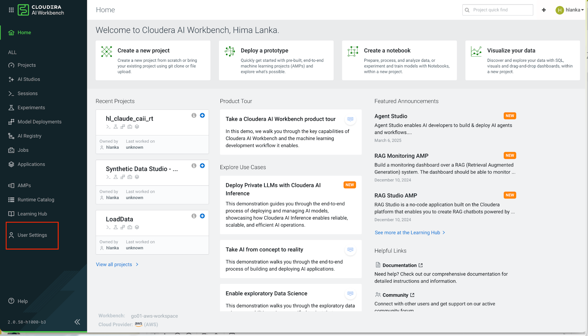
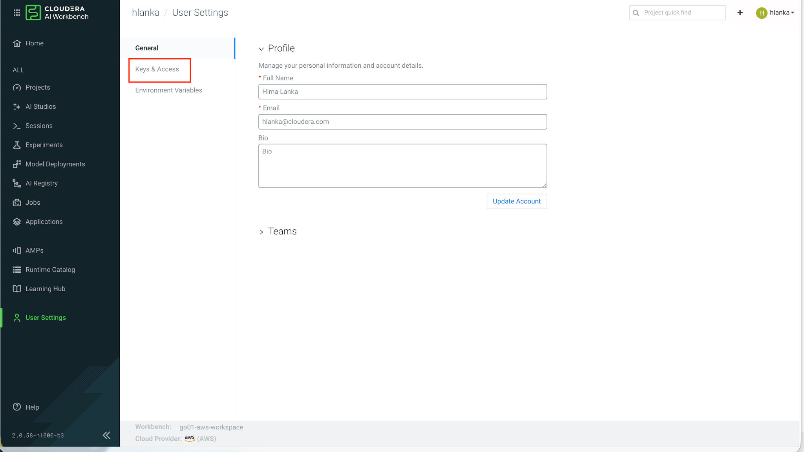
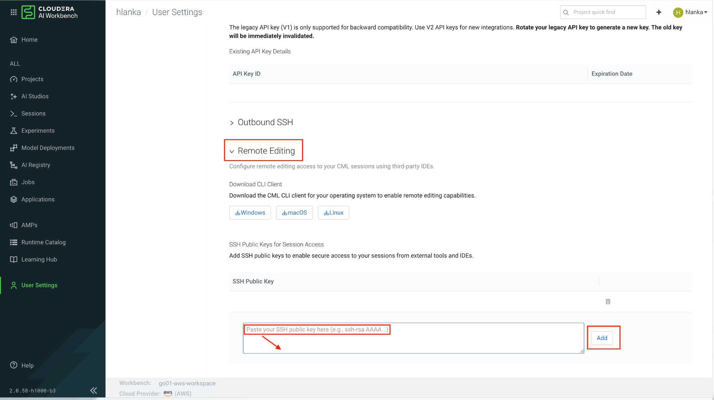
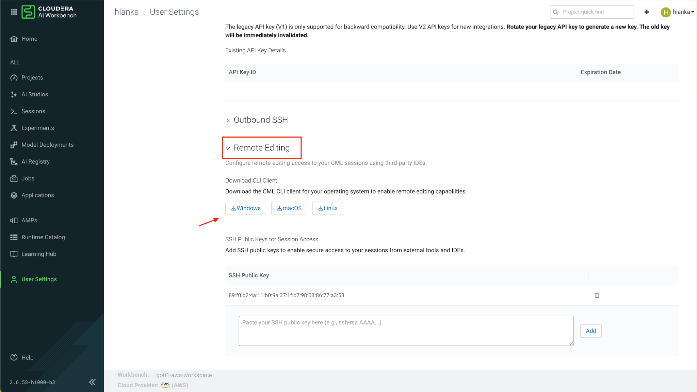
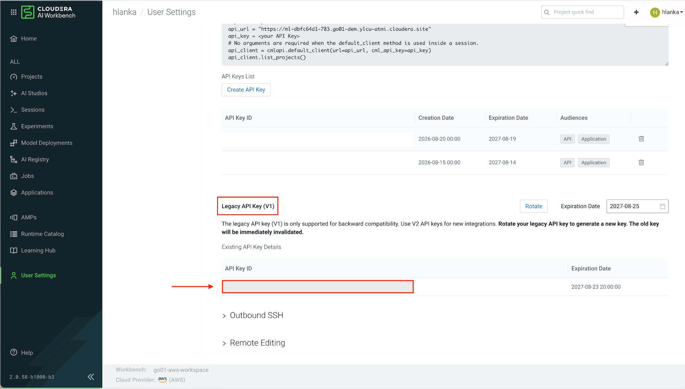
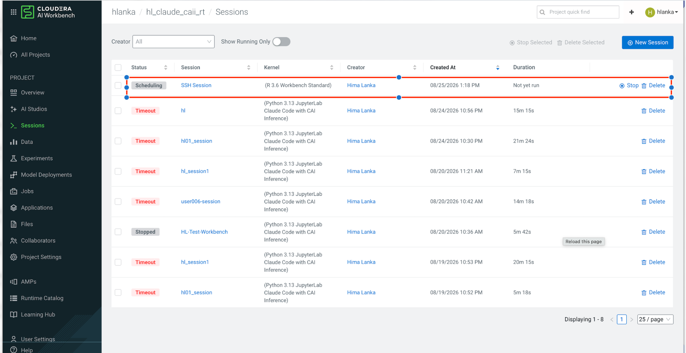
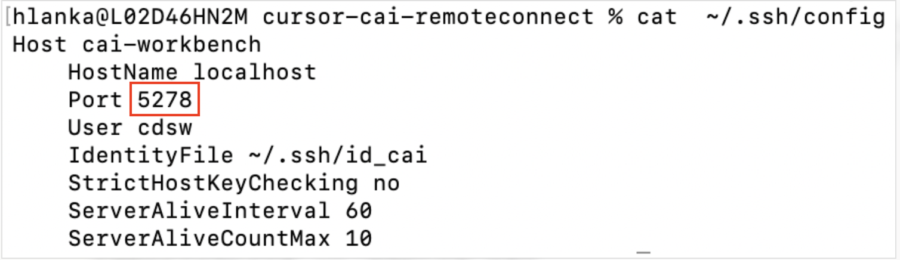
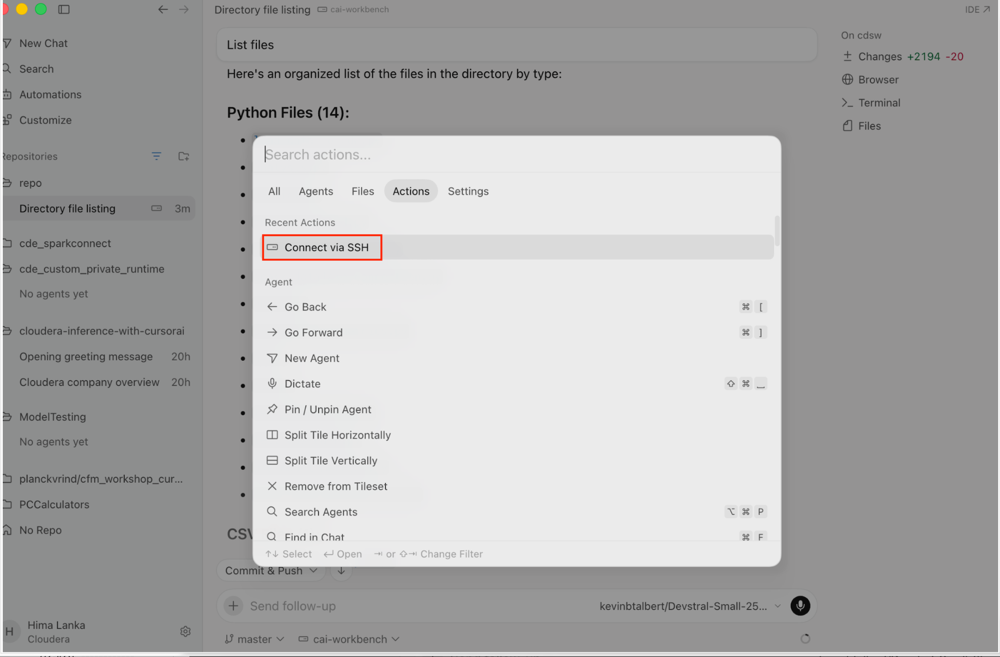
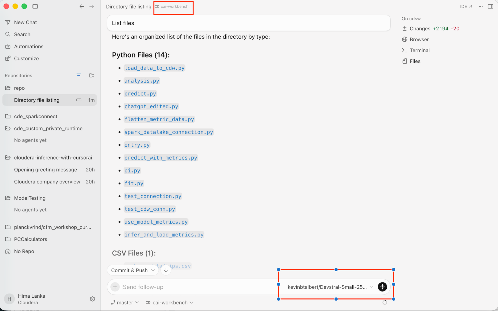

# Using Cursor with Cloudera AI (Remote SSH)

This guide explains how to connect **Cursor IDE** to your Cloudera AI workbench session using **Remote SSH** and the **cdswctl** CLI, enabling AI-assisted coding directly against your project environment.

## Prerequisites

Before connecting, ensure you have:

- [x] Completed [Login & Workbench Setup](../setup/login-and-project.md)
- [x] Created your team [project](../setup/project-and-runtimes.md)
- [x] **Cursor IDE** installed on your local machine ([cursor.com](https://cursor.com))

---

## One-time Setup

### 1. Generate an SSH Key

```bash
ssh-keygen -C cai
```

Accept the default location, or set the file to `/Users/<username>/.ssh/id_cai`. Optionally set a passphrase.

### 2. Copy the Public Key

```bash
cat ~/.ssh/id_cai.pub
```

Copy the entire output line.

### 3. Add the Key to the Workbench

In the Cloudera AI Workbench, go to **User Settings → Keys & Access → Remote Editing**, paste your public key into **SSH Public Key**, and click **Add**.





### 4. Download the CML CLI Client

On the same **Remote Editing** page, download the **CML CLI client** (`cdswctl`) for your operating system.



On Mac, if the download is blocked: **Finder → Control-click → Open**.



### 5. Add cdswctl to Your PATH

After downloading, unpack the archive and optionally add `cdswctl` to your system `PATH` environment variable.

### 6. Get Your Legacy API Key

In the Cloudera AI Workbench, go to **User Settings → Keys & Access → API Keys** and copy the **Legacy API Key** (not the plain "API Key").

Please feel free to **Rotate** the key as needed.



### 7. Create the SSH Config Entry

Add the following entry to `~/.ssh/config`:

```ssh-config
Host cai-workbench
    HostName localhost
    Port 3735
    User cdsw
    IdentityFile ~/.ssh/id_cai
    StrictHostKeyChecking no
    ServerAliveInterval 60
    ServerAliveCountMax 10
```

!!! note "Port Changes Each Session"
    The `Port` value will need updating each session — see step 4 under [Every-session Steps](#every-session-steps) below.

---

## Every-session Steps

### 1. Log In to CAI Workbench Remotely

Use the **Legacy API Key**, not the API Key ID:

```bash
cdswctl login -u https://<workbench-url> -n <username> -y <legacy_api_key>
```

If Mac prevents you from running the `cdswctl` command, remove the quarantine attribute:

```bash
xattr -d com.apple.quarantine /<PATH>/cdswctl
```

Wait for **"Login succeeded."**

### 2. Start the Endpoint

This creates the session and SSH tunnel. First, list available runtimes:

```bash
cdswctl runtimes list
```

Spin up a session using a specific runtime. For example, `-r 116` corresponds to **PBJ Workbench / Python 3.10**. It takes a minute or two:

```bash
cdswctl ssh-endpoint -p <username>/<cai_workbench_project_name> -r 116 -c 2 -m 4
```

You can verify from the CAI Workbench **Project → Sessions** tab that the new session has been created.



### 3. Read the Port

The command prints connection details:

```text
You can SSH to the session using
    ssh -p <PORT> cdsw@localhost
```

Leave this terminal open — this process is the tunnel.



### 4. Update the Port in SSH Config

If `<PORT>` differs from what is saved in `~/.ssh/config` (it changes every session), edit the `Port` line under `cai-workbench` to match.

### 5. Sanity Check (Optional)

In a second terminal:

```bash
ssh -p <PORT> cdsw@localhost
```

Run `whoami` — it should return `<username>`. Type `exit` to leave.

### 6. Connect in Cursor

1. Press **Cmd+Shift+P** (Mac) or **Ctrl+Shift+P** (Windows/Linux)
2. Select **Connect via SSH: Connect to Host**
3. Choose **`cai-workbench`**
4. Enter your key passphrase if prompted
5. **File → Open Folder → `/home/cdsw`**



Your SSH connection to the CAI session is ready for use in Cursor.

### 7. Shut Down When Done

Press **Ctrl+C** in the `cdswctl` terminal to shut down the session and stop consuming workbench resources.



---

## Pain Points

Two things worth doing to make this less tedious:

- **The shifting port is the main annoyance.** Check `cdswctl ssh-endpoint --help` for a flag to pin a fixed local port — if one exists in your version, you would not need to edit the config again each session. Verify the exact flag name in your installed version.
- **You can wrap login + endpoint in a small script** so each session is one command. Remember it would contain your API key in plaintext, so keep that file private (`chmod 600`).

---

## Alternative: Claude CLI

If you prefer working entirely in the browser without Remote SSH, see **[Claude with Private Model](claude-private-model.md)** for using the Claude CLI directly in the workbench terminal.
