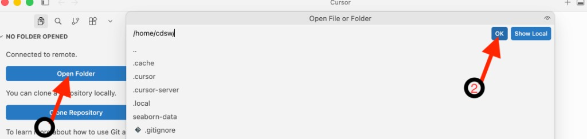

# Connect each session

Once one-time setup is complete, connecting each session takes two steps.

### 1. Run the Connection Script

From a terminal **inside your `<your-path>/cai-cursor` folder**, run:

```bash
CONNECT_CAI_ENV=./connect-cai.env ./connect-cursor-cai.sh
```

!!! important "Run from inside the folder"
    These commands must be executed from inside your `cai-cursor` folder — the same folder that contains `connect-cursor-cai.sh` and `connect-cai.env`. If you open a new terminal, change into that folder first before running the command above.

### 2. Expected Output

When everything is configured correctly, you should see output similar to this:

```text
*******************************************************************************
  STOP — Have you completed all prerequisite steps? (see script header)
*******************************************************************************
  The script will verify each item below before continuing:

  [1] cdswctl installed and on PATH
  [2] jq installed and on PATH
  [3] SSH key pair generated (~/.ssh/cai and ~/.ssh/cai.pub)
  [4] API_KEY set in connect-cai.env (current CAI API key, not Legacy)
  [5] PROJECT_NAME set to <CAI_USERNAME>/<project-name>
  [6] SSH public key uploaded to CAI → User Settings → Remote Editing
      (cannot be verified automatically — you must confirm this yourself)
*******************************************************************************

==> Running prerequisite checks...
==> [1/6] cdswctl: OK
==> [2/6] jq: OK
==> [3/6] SSH key pair: OK (~/.ssh/cai)
==> [4/6] API_KEY configured in ./connect-cai.env: OK
==> [5/6] PROJECT_NAME: OK (your-username/teamXX-project)
warning: [6/6] SSH public key in CAI cannot be verified automatically.
warning:       Confirm you have pasted this key into Cloudera AI:
warning:       User Settings → Keys & Access → Remote Editing → SSH Public Key
warning:       Public key file: ~/.ssh/cai.pub
warning:       Preview: ssh-ed25519 AAAA...
==> Prerequisite checks passed (project: your-username/teamXX-project)
==> Logging in to https://ml-810351e3-a81.zeta1-cd.z30z-14kp.cloudera.site as your-username...
Login succeeded
==> Auto-selecting PBJ Workbench runtime (Python 3.12, standard edition)...
==> Selected runtime ID: 838
==> Starting session (cpu=2, memory=4GB, gpu=0)...
==> Session started: abc123sessionid
==> Creating SSH config entry 'cai-workbench' (port 3735)
==> Starting SSH endpoint (session=abc123sessionid, local port=3735)...
Forwarding local port 3735 to port 2222 on session abc123sessionid in project your-username/teamXX-project.
You can SSH to the session using: ssh -p 3735 cdsw@localhost

===============================================================================
  SSH tunnel is active — keep this terminal open.
================================================================================

Sanity check (optional, in another terminal):
  ssh -i ~/.ssh/cai -p 3735 cdsw@localhost

Connect in Cursor:
  1. Cmd+Shift+P (Mac) or Ctrl+Shift+P (Windows/Linux)
  2. "Remote-SSH: Connect to Host"
  3. Choose: cai-workbench
  4. File → Open Folder → /home/cdsw

When finished:
  Press Ctrl+C here to stop the SSH tunnel.
  The CAI session may still be running — stop it in the Workbench UI if needed.

==> Press Ctrl+C to stop the tunnel.
```

!!! note "Session startup"
    Starting a session can take a minute or two depending on cluster resources. Verify the session shows **Running** in CAI → **Project → Sessions** if startup seems slow.

You can also verify from the CAI Workbench **Project → Sessions** tab that the new session has been created.


### 3. Connect in Cursor

Once you see **SSH tunnel is active**:

1. Press **Cmd+Shift+P** (Mac) or **Ctrl+Shift+P** (Windows/Linux)
2. Select **Remote-SSH: Connect to Host**
3. Choose **`cai-workbench`**

After a successful connection, Cursor opens a new window showing **NO FOLDER OPENED** and **Connected to remote.** You still need to open your project folder:

4. Click the blue **Open Folder** button in the Explorer sidebar
5. In the **Open File or Folder** dialog, enter **`/home/cdsw`** and click **OK**



You should then see **CDSW [SSH: cai-workbench]** in the sidebar with your file structure (e.g. `.cursor-server`, project files, etc.).


Your SSH connection to the CAI session is ready for use in Cursor. The window title should show `cdsw [SSH: cai-workbench]`.

#### Sanity Check (Optional)

In a second terminal:

```bash
ssh -i ~/.ssh/cai -p 3735 cdsw@localhost
```

Run `whoami` — it should return your username. Type `exit` to leave.

### 4. Shut Down When Done

Press **Ctrl+C** in the script terminal to stop the SSH tunnel.

The CAI session may still be running — stop it in the Workbench UI if you want to free resources.


---

**Next:** [Testing Cursor →](testing-cursor.md) · [← One-time Setup](one-time-setup.md)
