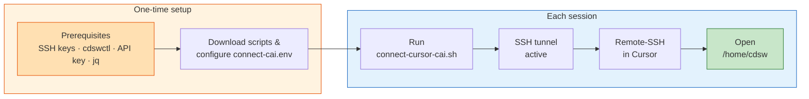
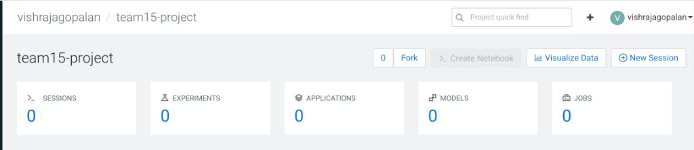

# Using Cursor with Cloudera AI (Remote SSH)

Connect **Cursor IDE** to your Cloudera AI workbench session using **Remote SSH**, so you can use AI-assisted coding directly against your project environment, data connections, and runtimes.

This guide uses an automated connection script (`connect-cursor-cai.sh`) that handles login, session startup, SSH tunneling, and SSH config updates for you. The script files are included in this lab guide.

## Quick overview



After one-time setup, each session is quick: from inside your `cai-cursor` folder, run `CONNECT_CAI_ENV=./connect-cai.env ./connect-cursor-cai.sh`, then connect Cursor via **Remote-SSH: Connect to Host** → `cai-workbench`.

---

## Your team project is ready

For this hackathon, **your team project has already been created** for you in the Cloudera AI Workbench. You do not need to create a new project.

Your facilitator will assign your team number and provide project details for your participant group. Each team gets a pre-created project following the naming pattern **`teamXX-project`**, where `XX` is your assigned team number (e.g. `team01-project`, `team07-project`).



*Figure: Example of a pre-created team project. Your project will follow the same `teamXX-project` pattern — use the team number assigned by your facilitator.*

When you open your assigned project, the breadcrumb in the Workbench shows `<your-username> / teamXX-project`. That means the full project slug for `connect-cai.env` would be:

```bash
PROJECT_NAME="<your-username>/teamXX-project"
```

Replace `<your-username>` with your Cloudera AI username and `XX` with your assigned team number.

To find **your** project slug:

1. Complete [Login & Workbench Setup](../../setup/login-and-project.md) and open **zeta1-workbench1**
2. Locate your assigned team project on the workbench home page (named `teamXX-project` for your team)
3. Open the project and copy the **full slug** from the browser URL bar or breadcrumb — it looks like `<your-username>/teamXX-project`

You will use this slug as `PROJECT_NAME` in your configuration file.

!!! note "Project owner"
    The owner in the URL is typically your Cloudera AI username. Always use the exact slug shown in the browser — do not guess the team number or owner.

---

## Prerequisites checklist

Complete every item before running the connection script.

### One-time setup

- [ ] Completed [Login & Workbench Setup](../../setup/login-and-project.md)
- [ ] **Cursor IDE** installed on your local machine ([cursor.com](https://cursor.com))
- [ ] SSH key pair generated with filename **`cai`** (not `id_ed25519` or a custom name) and moved to `~/.ssh/cai` / `~/.ssh/cai.pub`
- [ ] SSH public key added in CAI → **User Settings → Keys & Access → Remote Editing**
- [ ] `cdswctl` downloaded, unblocked (macOS), and on your `PATH`
- [ ] `jq` installed (`brew install jq` on macOS)
- [ ] API key created in CAI → **User Settings → Keys & Access → API Keys** (not Legacy)
- [ ] Connection scripts downloaded, `chmod +x connect-cursor-cai.sh` run, and `connect-cai.env` configured with your domain, username, API key, and project slug

### Each session

- [ ] Open a terminal in your `<your-path>/cai-cursor` folder and run `CONNECT_CAI_ENV=./connect-cai.env ./connect-cursor-cai.sh` (see [Connect each session](connect-each-session.md) below)
- [ ] Connect Cursor via **Remote-SSH: Connect to Host** → `cai-workbench`, then click **Open Folder** → `/home/cdsw`

---

## Quick links

- [One-time Setup](one-time-setup.md)
- [Connect each session](connect-each-session.md)
- [Testing Cursor](testing-cursor.md)
