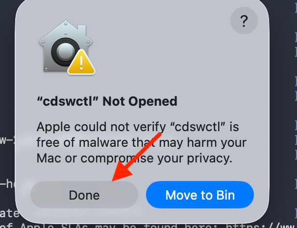
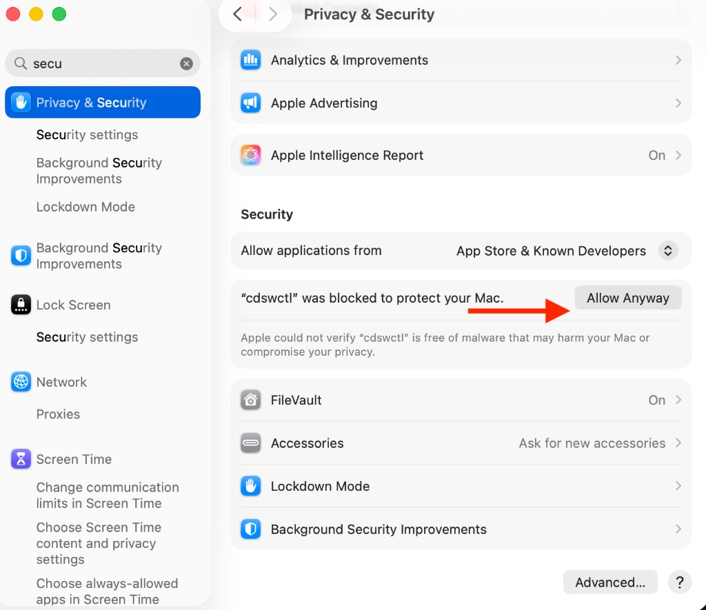

# One-time Setup

### 1. Generate an SSH Key

!!! warning "You must name the key `cai` — do not use the default or your own name"
    When `ssh-keygen` asks **"Enter file in which to save the key"**, you **must** type exactly:

    ```text
    cai
    ```

    **Do not** press Enter to accept the default filename (e.g. `id_ed25519` or `id_rsa`). **Do not** use your username or any other custom name.

Run the following command to generate a new SSH key pair:

```bash
ssh-keygen -C cai
```

When prompted **"Enter file in which to save the key"**, type `cai` and press **Enter**. This creates `cai` and `cai.pub` in your current directory — **not** the default `~/.ssh/id_ed25519`.

Press **Enter** again to skip the passphrase prompts (leave both empty).


*In the screenshot above, note the filename is `cai` — not `id_ed25519` or any other name.*

### 2. Move the Keys to `~/.ssh/`

If the `~/.ssh/` directory does not exist yet (common on a new machine), create it first:

```bash
mkdir -p ~/.ssh
chmod 700 ~/.ssh
```

Move the generated private and public key files into your SSH directory:

```bash
mv cai* ~/.ssh/
```

Verify the keys are in place:

```bash
ls ~/.ssh/cai*
```

You should see `~/.ssh/cai` (private key) and `~/.ssh/cai.pub` (public key).


### 3. Copy the Public Key

```bash
cat ~/.ssh/cai.pub
```

Copy the entire output line.

### 4. Add the Key to the Workbench

In the Cloudera AI Workbench, go to **User Settings → Keys & Access → Remote Editing**, paste your public key into **SSH Public Key**, and click **Add**.


While you are on the **Remote Editing** page, note that the **CML CLI client** (`cdswctl`) can be downloaded for your operating system — you will do this in the next step.


### 5. Download and Unblock the CML CLI Client

Download the **CML CLI client** (`cdswctl`) for your operating system from the **Remote Editing** section shown in step 4.

Unpack the downloaded archive. You should have a folder containing the `cdswctl` binary (for example, `cdsw-2.0.0.95880-darwin-amd64` on Mac).

#### Mac: Allow cdswctl to Run

macOS quarantines downloaded files and will **not** let you run `cdswctl` directly from the terminal on first use. When you try, you may see a dialog like this — click **Done** (do not click Move to Bin):



Then allow the binary manually:

1. Open **System Settings → Privacy & Security → Security**
2. Scroll down until you see a message that **`"cdswctl" was blocked`** to protect your Mac
3. Click **Allow Anyway**



4. Run `cdswctl` once more from the terminal — macOS may ask you to confirm again; choose **Open**

### 6. Add cdswctl to Your PATH

Add the folder containing `cdswctl` to your shell `PATH` so you can run it from any directory.

#### Get the Path to cdswctl

In your terminal, change into the folder where you unpacked `cdswctl`, then print the full path:

```bash
cd /path/to/your/unpacked/cdsw-folder
pwd
```

Copy the output — you will use it in the steps below. The folder name will look something like `cdsw-2.0.0.95880-darwin-amd64`.

Verify `cdswctl` is in that folder:

```bash
ls cdswctl
```

#### Mac (zsh)

**1. Create `~/.zshrc` if it does not exist**

```bash
touch ~/.zshrc
```

**2. Open the file to add your PATH**

Open it in TextEdit for easy editing:

```bash
open -e ~/.zshrc
```

Alternatively, edit in the terminal with `nano ~/.zshrc`.

**3. Add your PATH variable**

Paste the following line at the end of the file, replacing the path with the output from `pwd` above:

```bash
export PATH="/Users/<username>/path/to/cdsw-2.0.0.95880-darwin-amd64:$PATH"
```

Save the file (**Cmd+S**) and close it.

**4. Load the updated PATH**

```bash
source ~/.zshrc
```

**5. Verify**

```bash
cdswctl --help
```

You should see the `cdswctl` usage output without a "command not found" error.

!!! note "Mac Apple Silicon: bad CPU type in executable"
    If `cdswctl --help` returns:

    ```text
    zsh: bad CPU type in executable: cdswctl
    ```

    The downloaded binary is Intel-only and your Mac needs Rosetta. Install it (one-time):

    ```bash
    softwareupdate --install-rosetta
    ```

    Then rerun:

    ```bash
    cdswctl --help
    ```

    This step is only needed if you see the **bad CPU type** error above.

### 7. Install jq

The connection script uses `jq` to auto-select the correct Python runtime.

**macOS:**

```bash
brew install jq
```

Verify:

```bash
jq --version
```

### 8. Create an API Key

In the Cloudera AI Workbench, go to **User Settings → Keys & Access → API Keys** and click **Create API Key**.


In the confirmation dialog, accept the default expiry settings (ensure **API** is checked under Audiences) and click **Create**.

!!! warning "Save Your API Key Immediately"
    API keys are **ephemeral** — they are shown only once. Copy the generated API key and save it in a notepad or password manager. You will need this key in your `connect-cai.env` file.


### 9. Download the Connection Scripts

Download both connection script files from the links below.

| File | Purpose |
|------|---------|
| [connect-cursor-cai.sh](../scripts/connect-cursor-cai.sh) | Main connection script — logs in, starts a session, and opens the SSH tunnel |
| [connect-cai.env.example](../scripts/connect-cai.env.example) | Configuration template — copy to `connect-cai.env` and fill in your values |

**1. Create a working folder** in a location of your choice:

```bash
mkdir -p <your-path>/cai-cursor
cd <your-path>/cai-cursor
```

Replace `<your-path>` with any directory you prefer (for example, `~/Documents` or `~/Downloads`).

**2. Download both files** from the links in the table above and save them **into this folder** (right-click → **Save link as…** and choose `<your-path>/cai-cursor` as the destination).

**3. Make the script executable** (required — browser downloads are not executable by default):

```bash
chmod +x connect-cursor-cai.sh
```

!!! warning "Permission denied?"
    If you see `zsh: permission denied: ./connect-cursor-cai.sh` when running the script, you skipped this step. Run `chmod +x connect-cursor-cai.sh` from inside your `cai-cursor` folder, then try again.

When finished, your folder should contain:

```text
<your-path>/cai-cursor/
├── connect-cursor-cai.sh
├── connect-cai.env.example
└── connect-cai.env          (created in step 10)
```

!!! warning "Always run the script from inside this folder"
    Open your terminal **inside** `<your-path>/cai-cursor` before running the connection script. Both `connect-cursor-cai.sh` and `connect-cai.env` must be in your current working directory.

### 10. Configure Your Environment

Your facilitator will provide a pre-filled `connect-cai.env` with the shared workshop values. Copy the example config **in the same folder**, then update **only the values for your team**:

```bash
cd <your-path>/cai-cursor
cp connect-cai.env.example connect-cai.env
```

!!! note "Values provided by your facilitator"
    Most settings in `connect-cai.env` (such as `CAI_DOMAIN`) will be provided to you by your facilitator. **Update only the values that are specific to your team** — typically your username, API key, and project slug.

Open `connect-cai.env` in Cursor or any text editor and confirm or update these mandatory values:

```bash
CAI_DOMAIN="https://ml-810351e3-a81.zeta1-cd.z30z-14kp.cloudera.site"
CAI_USERNAME="your-username"
API_KEY="your-api-key"
PROJECT_NAME="<your-username>/teamXX-project"
```

| Variable | What to set |
|----------|-------------|
| `CAI_DOMAIN` | Provided by your facilitator (workbench URL for **zeta1-workbench1**) |
| `CAI_USERNAME` | Your Cloudera AI username from workshop credentials |
| `API_KEY` | The API key you created in step 8 (not a Legacy key) |
| `PROJECT_NAME` | Your team's project slug — update `XX` to your assigned team number, e.g. `<your-username>/team07-project` |

!!! warning "PROJECT_NAME format"
    `PROJECT_NAME` must be the **full slug** (`<your-username>/teamXX-project`), not just the project name. For example, use `your-username/team07-project`, not `team07-project` alone.

The script automatically creates and updates the `cai-workbench` entry in `~/.ssh/config` — you do not need to edit SSH config manually.

---

**Next:** [Connect each session →](connect-each-session.md)
