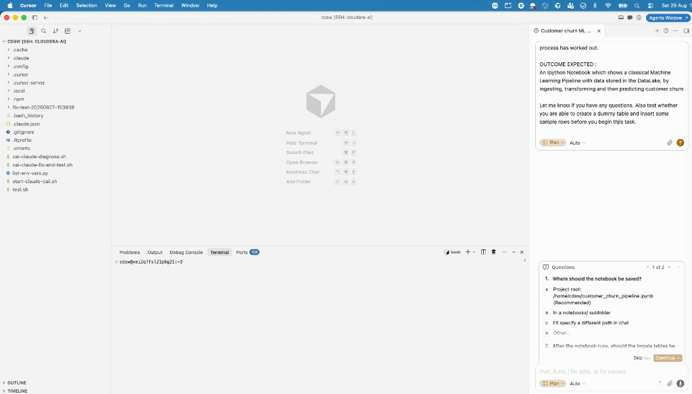
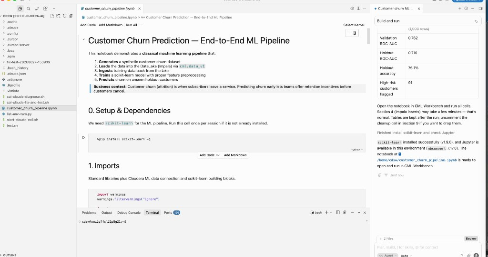

# Testing Cursor

Once connected to your Cloudera AI project via Remote SSH, you can verify that Cursor works end-to-end by asking the AI Agent to build a sample machine learning pipeline that reads from and writes to the DataLake.

### 1. Open the Agent Window

In the Cursor window connected to your remote Cloudera project, press **Cmd+L** (Mac) or **Ctrl+L** (Windows/Linux) to start a **New Agent** window.

### 2. Enter the Test Prompt

Copy and paste the following prompt into the Agent window:

```text
ROLE : You are an expert Python .
CONTEXT: Your goal is to build a sample ML Pipeline on a customer user case
INSTRUCTIONS :
1. Create a sample dataset that will be helpful in predicting customer churn
2. Insert that data into a table. Here is a sample way to connect to the datalake
import cml.data_v1 as cmldata

CONNECTION_NAME = "default-impala-aws"
conn = cmldata.get_connection(CONNECTION_NAME)

## Sample Usage to get pandas data frame
EXAMPLE_SQL_QUERY = "show databases"
dataframe = conn.get_pandas_dataframe(EXAMPLE_SQL_QUERY)
print(dataframe)
# Closing the connection
conn.close()

## Other Usage Notes:

## Alternate Sample Usage to provide different credentials as optional parameters
#conn = cmldata.get_connection(
#    CONNECTION_NAME, {"USERNAME": "someuser", "PASSWORD": "somepassword"}
#)

## Alternate Sample Usage to get DB API Connection interface
#db_conn = conn.get_base_connection()

## Alternate Sample Usage to get DB API Cursor interface
#db_cursor = conn.get_cursor()
#db_cursor.execute(EXAMPLE_SQL_QUERY)
#for row in db_cursor:
#  print(row)

3. Now use this data to build a sample customer churn model with scikitlearn
4. Use unseen data build customer churn

FINAL INSTRUCTIONS: Create a Ipython notebook, with good documentation to show my users how this whole process has worked out.

OUTCOME EXPECTED :
An Ipython Notebook which shows a classical Machine Learning Pipeline with data stored in the DataLake, by ingesting, transforming and then predicting customer churn

Let me know if you have any questions. Also test whether you are able to create a dummy table and insert some sample rows before you begin this task.
```

!!! note "This May Take a Few Minutes"
    Cursor will plan and evaluate options before generating the notebook. You may be asked for permissions to run code and save files — approve these prompts to allow the Agent to proceed.



### 3. Review the Generated Notebook

When the Agent finishes, it creates an IPython notebook (typically `customer_churn_pipeline.ipynb`) in your project directory. Your output should look similar to this [sample notebook generated by Cursor../../artifacts/customer_churn_pipeline.ipynb) — download or open it to explore the full pipeline before running your own.

The notebook demonstrates a full ML pipeline:

1. **Generates** a synthetic customer churn dataset
2. **Loads** the data into the DataLake (Impala) via `cml.data_v1`
3. **Ingests** training data back from the lake
4. **Trains** a scikit-learn model with proper feature preprocessing
5. **Predicts** churn on unseen holdout customers



### 4. Run and Verify the Notebook

Open `customer_churn_pipeline.ipynb` in Cursor and run the cells sequentially. The notebook installs `scikit-learn` if needed, creates tables in Impala, trains a model, and reports metrics such as ROC-AUC and accuracy on holdout data.

Compare your results against the [sample notebook../../artifacts/customer_churn_pipeline.ipynb) included in this documentation site, or browse it on GitHub at [`artifacts/customer_churn_pipeline.ipynb`](https://github.com/SuperEllipse/zeta-hol/blob/main/artifacts/customer_churn_pipeline.ipynb).

Section 4 (Impala inserts) may take a few minutes to complete.

---

## Troubleshooting

| Issue | Solution |
|-------|----------|
| `zsh: permission denied: ./connect-cursor-cai.sh` | Run `chmod +x connect-cursor-cai.sh` from inside your `cai-cursor` folder — see [step 9](one-time-setup.md#9-download-the-connection-scripts) |
| `SSH private key not found at ~/.ssh/cai` | Regenerate the key and name it exactly `cai` when prompted — see [step 1](one-time-setup.md#1-generate-an-ssh-key). Do not use `id_ed25519` or a custom name |
| `cdswctl not found` | Revisit [step 6 — Add cdswctl to Your PATH](one-time-setup.md#6-add-cdswctl-to-your-path) |
| `jq not found` | Install jq: `brew install jq` (macOS) |
| Login failed (401) | Create a new API key (not Legacy) and update `connect-cai.env` |
| `PROJECT_NAME must be the full project slug` | Use `<your-username>/teamXX-project` from the browser URL, not just `teamXX-project` |
| Port already in use | The script auto-picks the next free port; check output for the actual port |
| Session startup slow | Wait 1–2 minutes; verify session is **Running** in CAI → Project → Sessions |
| Mac blocks `cdswctl` | Revisit [step 5 — Allow cdswctl to Run](one-time-setup.md#mac-allow-cdswctl-to-run) |

---

## Alternative: Claude CLI

If you prefer working entirely in the browser without Remote SSH, see **[Claude with Private Model](../claude-private-model.md)** for using the Claude CLI directly in the workbench terminal.

---

[← Connect each session](connect-each-session.md) · [← One-time Setup](one-time-setup.md) · [Overview](index.md)
